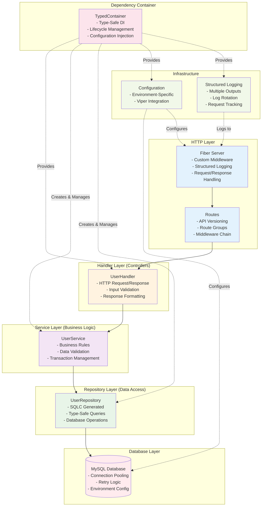

<div align="center">
  
</div>

# 🚀 Scaffold: High-Performance Go Application Boilerplate

<div align="center">

[](https://golang.org/dl/)
[](https://github.com/MayukhSobo/scaffold)
[](LICENSE)
[](https://goreportcard.com/report/github.com/MayukhSobo/scaffold)
[](https://github.com/MayukhSobo/scaffold/commits/main)

A production-ready Go application boilerplate with **Fiber web framework**, **MySQL database**, **structured logging**, and **dependency injection**. Built for performance, scalability, and maintainability.

</div>

---

## ✨ Features

- **⚡ High-Performance Web Framework**: Built with [Fiber v2](https://github.com/gofiber/fiber) for lightning-fast HTTP performance
- **🗄️ Database Integration**: MySQL with connection pooling, retry logic, and environment-specific configurations
- **📊 Structured Logging**: Custom structured logging with Zerolog, supporting console and file outputs with rotation
- **🔌 Dependency Injection**: Type-safe dependency container for clean architecture and testability
- **🧪 Comprehensive Testing**: Unit tests, integration tests, and database-specific test suites
- **🔧 Environment Configuration**: Flexible configuration management with Viper for local, Docker, and production environments
- **🚀 Hot Reloading**: Development workflow with Air for live code reloading
- **🐳 Docker Ready**: Multi-stage Dockerfile with Docker Compose for complete development environment
- **🔄 Task Automation**: Comprehensive task system for build, test, and deployment operations
- **🔒 Security Features**: Request ID tracking, CORS configuration, and password redaction in API responses
- **📈 Performance Monitoring**: Request latency tracking and human-readable metrics in logs

---

## 🛠️ Core Technologies

### Web Framework & HTTP
| Library | Description |
|---------|-------------|
| [`github.com/gofiber/fiber/v2`](https://github.com/gofiber/fiber) | High-performance HTTP web framework built on Fasthttp |
| [`github.com/spf13/viper`](https://github.com/spf13/viper) | Complete configuration solution with multiple format support |

### Database & Data Access
| Library | Description |
|---------|-------------|
| [`github.com/go-sql-driver/mysql`](https://github.com/go-sql-driver/mysql) | MySQL driver for Go's database/sql package |
| **SQLC** | Type-safe SQL code generation for Go |

### Logging & Monitoring
| Library | Description |
|---------|-------------|
| [`github.com/rs/zerolog`](https://github.com/rs/zerolog) | Blazing fast, structured, leveled logging |
| [`gopkg.in/natefinch/lumberjack.v2`](https://github.com/natefinch/lumberjack) | Log rotation for file-based logging |

### Development & Testing
| Tool | Description |
|------|-------------|
| [`github.com/air-verse/air`](https://github.com/air-verse/air) | Live-reloading for Go applications |
| [`gotest.tools/gotestsum`](https://github.com/gotestyourself/gotestsum) | Enhanced 'go test' runner with better output |
| [`github.com/golangci/golangci-lint`](https://github.com/golangci/golangci-lint) | Fast Go linters runner |

---

## 🏗️ Project Structure

```
scaffold/
├── cmd/
│   └── server/              # Application entry point
│       ├── main.go         # Main application with dependency injection
│       └── art.go          # Startup banner
├── configs/                 # Environment-specific configurations
│   ├── local.yml           # Local development settings
│   ├── docker.yml          # Docker environment settings
│   └── prod.yml            # Production settings
├── internal/               # Private application code
│   ├── handler/            # HTTP handlers (controllers)
│   ├── repository/         # Data access layer
│   │   └── users/          # User repository with SQLC generated code
│   ├── routes/             # Route definitions and registration
│   ├── server/             # Fiber server configuration
│   └── service/            # Business logic layer
├── pkg/                    # Public packages
│   ├── config/             # Configuration management
│   ├── container/          # Dependency injection container
│   ├── db/                 # Database connection and utilities
│   ├── http/               # HTTP utilities (response formatting)
│   ├── log/                # Structured logging system
│   └── utils/              # Common utilities
├── db/                     # Database files
│   ├── queries/            # SQL queries for SQLC
│   └── mysql-init.sql      # Database initialization
├── migrations/             # Database migration files
├── scripts/                # Automation scripts
│   ├── database/           # Database-related scripts
│   └── docker/             # Docker utilities
├── tasks/                  # Task automation definitions
├── docs/                   # Documentation
├── .air.toml               # Air configuration for hot reloading
├── sqlc.yaml               # SQLC configuration
├── Taskfile.yml            # Main task runner configuration
└── versions.yml            # Centralized version management
```

---

## 🏛️ Architecture

The application follows a clean, layered architecture with dependency injection:



### Architecture Principles

- **Dependency Injection**: TypedContainer manages all dependencies with type safety
- **Layered Architecture**: Clear separation between HTTP, business logic, and data access
- **Interface-Driven Design**: Services and repositories implement interfaces for testability
- **Configuration Management**: Environment-specific configurations with Viper
- **Structured Logging**: Comprehensive logging with request tracking and performance metrics
- **Database Abstraction**: SQLC generates type-safe database code from SQL queries

---

## 🚀 Quick Start

### Prerequisites

- [Go 1.24+](https://golang.org/dl/)
- [Task](https://taskfile.dev/installation/)
- [Docker & Docker Compose](https://www.docker.com/get-started)
- [MySQL](https://dev.mysql.com/downloads/) (for local development)

### Installation

1. **Clone the repository:**
   ```bash
   git clone https://github.com/MayukhSobo/scaffold.git
   cd scaffold
   ```

2. **Install dependencies:**
   ```bash
   task deps:install
   ```

3. **Setup database:**
   ```bash
   # For local development
   task db:setup:local
   
   # For Docker development
   task docker:compose:up
   ```

4. **Start development server:**
   ```bash
   # With hot reloading
   task dev:hot
   
   # Or build and run
   task build:debug
   ./build/scaffold-debug
   ```

---

## 📡 API Endpoints

The application provides the following REST API endpoints:

### System Endpoints
- `GET /` - Welcome message and application info
- `GET /health` - Health check endpoint
- `GET /ping` - Simple ping/pong response

### User Management API
- `GET /api/v1/users/admin` - Retrieve all admin users
- `GET /api/v1/users/pending-verification` - Retrieve users pending verification

### API Response Format
```json
{
  "code": 0,
  "message": "success",
  "data": {
    "count": 1,
    "users": [
      {
        "id": 1,
        "username": "admin",
        "email": "admin@example.com",
        "password_hash": "***REDACTED***",
        "role": "admin",
        "status": "active"
      }
    ]
  }
}
```

**Security Note**: Sensitive fields like `password_hash` are automatically redacted in API responses using custom struct tags and reflection.

---

## 🧪 Testing

### Run All Tests
```bash
task test:all
```

### Specific Test Categories
```bash
# Unit tests
task test:unit

# Integration tests  
task test:integration

# Database tests
task test:db:all
task test:db:local    # Local MySQL tests
task test:db:docker   # Docker MySQL tests

# Race condition detection
task test:race

# Benchmarks
task test:bench
```

### Coverage Reports
```bash
# Generate and open coverage report
task test:coverage:open

# Generate coverage treemap
task test:coverage:treemap
```

---

## 🔧 Configuration

The application supports multiple environments with specific configurations:

### Local Development (`configs/local.yml`)
```yaml
env: local
app:
  name: "Scaffold v1.0.0"
  version: "1.0.0"
http:
  port: 8000
db:
  mysql:
    host: 127.0.0.1
    port: 3306
    user: scaffold
    password: my_secure_password_123
    database: user
log:
  level: "debug"
  loggers:
    console:
      driver: "console"
      enabled: true
      colors: true
```

### Docker Environment (`configs/docker.yml`)
```yaml
env: docker
db:
  mysql:
    host: mysql
    port: 3306
    user: scaffold
    password: bXlfc2VjdXJlX3Bhc3N3b3JkXzEyMw==
    database: user
```

### Production (`configs/prod.yml`)
```yaml
env: production
log:
  level: "info"
  loggers:
    file:
      driver: "file"
      enabled: true
      directory: "/var/log/scaffold"
      filename: "app.log"
      json_format: true
      max_size: 100
      max_backups: 5
      max_age: 30
      compress: true
```

---

## 🐳 Docker Development

### Start Complete Environment
```bash
# Start MySQL, Adminer, and application
task docker:compose:up

# View logs
task docker:compose:logs

# Connect to MySQL
task docker:compose:mysql

# Open Adminer (database management)
task docker:compose:adminer
```

### Database Management
```bash
# Generate database initialization script
task db:generate:init

# Run migrations
task db:migrate

# Generate SQLC code
task db:generate:sqlc
```

---

## 📊 Logging Features

The application includes a sophisticated logging system:

### Structured HTTP Request Logging
```json
{
  "level": "info",
  "time": "2024-01-15T10:30:45Z",
  "message": "HTTP Request",
  "method": "GET",
  "path": "/api/v1/users/admin",
  "status": 200,
  "latency": "15.67ms",
  "bytes_sent": "2.1KB",
  "request_id": "req-123456"
}
```

### Smart Field Inclusion
- **Query parameters**: Only logged when present
- **IP addresses**: Excluded for localhost requests
- **User agents**: Development tools (curl, Postman, Insomnia) are filtered out
- **Request IDs**: Included for request tracing

### Human-Readable Metrics
- **Latency**: `15.67ms`, `1.23s`, `250µs`
- **Bytes**: `2.1KB`, `1.5MB`, `245B`
- **Log Levels**: INFO (2xx-3xx), WARN (4xx), ERROR (5xx)

---

## 🔄 Development Workflow

### Hot Reloading Development
```bash
# Start with Air hot reloading
task dev:hot

# The server will automatically restart on code changes
```

### Code Quality
```bash
# Run linting
task quality:lint

# Format code
task quality:fmt

# Run security checks
task quality:security

# Complete quality check
task quality:all
```

### Building
```bash
# Debug build with race detection
task build:debug

# Release builds
task build:release:linux
task build:release:darwin
task build:release:windows

# Build all platforms
task build:release:all
```

---

## 📚 Documentation

| Topic | File | Description |
|-------|------|-------------|
| **Development Guide** | [docs/development-guide.md](docs/development-guide.md) | Development workflows and best practices |
| **Task System** | [docs/task-system.md](docs/task-system.md) | Task automation and build system |
| **Container Architecture** | [docs/container-architecture.md](docs/container-architecture.md) | Dependency injection patterns |
| **CI/CD** | [docs/ci-cd.md](docs/ci-cd.md) | Continuous integration and deployment |
| **Version Management** | [docs/version-management.md](docs/version-management.md) | Centralized version control |
| **Task Reference** | [docs/task-reference.md](docs/task-reference.md) | Complete task command reference |

---

## 🤝 Contributing

Contributions are welcome! Please follow these steps:

1. Fork the repository
2. Create a feature branch (`git checkout -b feature/amazing-feature`)
3. Run tests (`task test:all`)
4. Run quality checks (`task quality:all`)
5. Commit your changes (`git commit -m 'Add amazing feature'`)
6. Push to the branch (`git push origin feature/amazing-feature`)
7. Open a Pull Request

### Development Setup
```bash
# Install development tools
task deps:install

# Setup pre-commit hooks
task setup:hooks

# Run all checks (same as CI)
task ci:pr
```

---

## 📜 License

This project is licensed under the MIT License - see the [LICENSE](LICENSE) file for details.

---

## 🙏 Acknowledgments

- [Fiber](https://github.com/gofiber/fiber) for the high-performance web framework
- [Zerolog](https://github.com/rs/zerolog) for structured logging
- [Viper](https://github.com/spf13/viper) for configuration management
- [SQLC](https://github.com/kyleconroy/sqlc) for type-safe SQL code generation
- [Task](https://taskfile.dev/) for build automation
