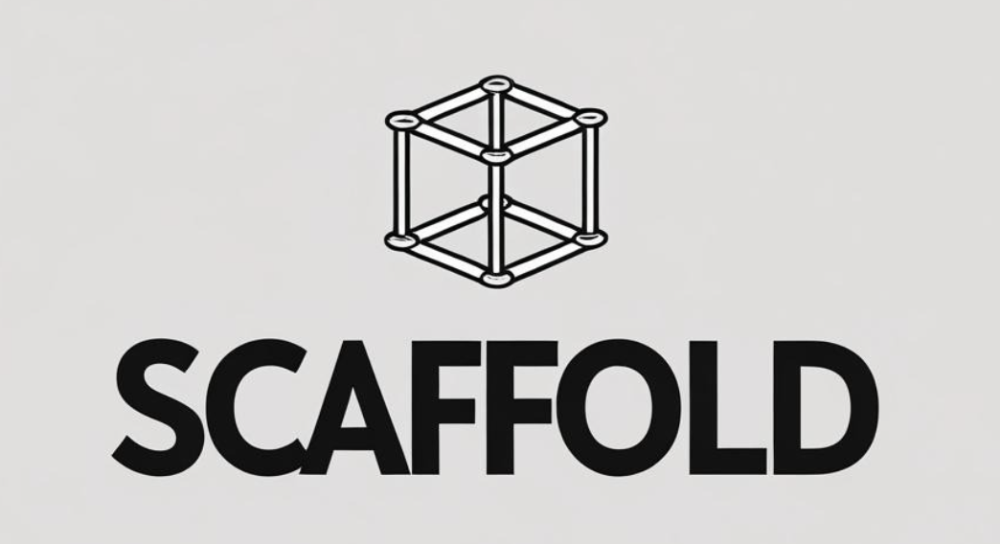

<div align="center">
  
</div>

# 🚀 Scaffold: High-Performance Go Application Boilerplate

<div align="center">

[](https://golang.org/dl/)
[](https://github.com/MayukhSobo/scaffold)
[](LICENSE)
[](https://goreportcard.com/report/github.com/MayukhSobo/scaffold)
[](https://github.com/MayukhSobo/scaffold/commits/main)

A production-ready Go application boilerplate, engineered for performance, developer efficiency, and robust tooling. Featuring a modular build system with Task, advanced testing & coverage, hot-reloading, and optimized cross-platform builds.

</div>

---

## ✨ Features

- **🔩 Modular Build System**: Powered by a modular `Taskfile` structure for streamlined, organized, and maintainable builds and development tasks.
- **⚡ Hot-Reloading**: Uses `air` for live-reloading during development, boosting productivity.
- **🧪 Comprehensive Testing**: Integrated with `gotestsum` for beautiful, readable test outputs. Supports unit, integration, and benchmark tests.
- **📊 Advanced Code Coverage**:
  - **Standard HTML reports**.
  - **Enhanced function-level reports** via `gocov` and `gocov-html`.
  - **Interactive visual treemaps** via `go-cover-treemap`.
- **🏆 Code Quality Assurance**:
  - **Linting** with `golangci-lint` using a comprehensive ruleset with smart version management.
  - **Formatting** with `gofmt`.
  - **Static analysis** with `go vet`.
- **⚙️ Configuration Management**: Flexible configuration loading for different environments using `viper`.
- **🚀 Optimized Production Builds**:
  - **Cross-platform compilation** for Linux, macOS, and Windows.
  - **Aggressive size reduction** using `ldflags` (`-s -w`).
  - **UPX compression** for ultra-small binaries (up to 85% size reduction).
- **🐳 Docker Ready**: Multi-stage `Dockerfile` for small, secure production images.
- **🎛️ Centralized Binary Naming**: Easily manage binary names from a single variable in the `Taskfile`.
- **📖 Self-Documenting**: Includes a `task help:help` command for a detailed overview of all available tasks.

---

## 🛠️ Key Dependencies

### Core Libraries

| Library                                                                       | Description                           |
| ----------------------------------------------------------------------------- | ------------------------------------- |
| [`github.com/gin-gonic/gin`](https://github.com/gin-gonic/gin)                | High-performance HTTP web framework.  |
| [`github.com/spf13/viper`](https://github.com/spf13/viper)                    | Complete configuration solution.      |
| [`github.com/rs/zerolog`](https://github.com/rs/zerolog)                      | Blazing fast, structured JSON logger. |
| [`gorm.io/gorm`](https://github.com/go-gorm/gorm)                             | The fantastic ORM library for Go.     |
| [`gopkg.in/natefinch/lumberjack.v2`](https://github.com/natefinch/lumberjack) | Log rotation for file-based logging.  |

### Development & Tooling

| Tool                                                                                             | Description                                     |
| ------------------------------------------------------------------------------------------------ | ----------------------------------------------- |
| [`github.com/air-verse/air`](https://github.com/air-verse/air)                                   | Live-reloading for Go applications.             |
| [`gotest.tools/gotestsum`](https://github.com/gotestyourself/gotestsum)                          | 'go test' runner with custom output formatting. |
| [`github.com/golangci/golangci-lint`](https://github.com/golangci/golangci-lint)                 | Fast Go linters runner.                         |
| [`github.com/axw/gocov`](https://github.com/axw/gocov)                                           | Coverage reporting tool.                        |
| [`github.com/matm/gocov-html`](https://github.com/matm/gocov-html)                               | Generates HTML reports from `gocov` data.       |
| [`github.com/nikolaydubina/go-cover-treemap`](https://github.com/nikolaydubina/go-cover-treemap) | Generates visual treemaps for coverage.         |

---

## 🏗️ Project Structure

```
scaffold/
├── build/                   # Build artifacts (binaries)
├── cmd/
│   └── server/              # Main application entrypoint
├── configs/                 # Configuration files (local.yml, prod.yml)
├── internal/                # Internal application code
│   ├── handler/
│   ├── middleware/
│   ├── model/
│   ├── repository/
│   └── service/
├── pkg/                     # Public packages
│   ├── config/
│   ├── helper/
│   ├── http/
│   └── log/
├── tasks/                   # Modular task definitions
│   ├── build.yml            # Build-related tasks
│   ├── clean.yml            # Cleanup tasks
│   ├── config.yml           # Configuration validation
│   ├── deps.yml             # Dependency management
│   ├── dev.yml              # Development tasks
│   ├── docker.yml           # Docker operations
│   ├── help.yml             # Help documentation
│   ├── quality.yml          # Code quality (lint, fmt, vet)
│   └── test.yml             # Testing tasks
├── .air.toml                # Configuration for hot-reloading (air)
├── .golangci.yml            # Configuration for golangci-lint
├── Dockerfile               # Multi-stage Dockerfile
├── go.mod
├── go.sum
└── Taskfile.yml             # Main task configuration with includes
```

---

## 🏛️ Architecture

This project follows a classic layered architecture pattern to ensure separation of concerns, making it modular, scalable, and easy to maintain.


### Layer Descriptions

- **Web Layer**: Receives and responds to HTTP requests. Includes the Gin router, middleware for cross-cutting concerns (like logging, CORS), and handlers for request parsing and validation.
- **Business Logic (Service) Layer**: Contains the core application logic, orchestrates data from repositories, and implements business rules. It is completely decoupled from the web layer.
- **Data Access (Repository) Layer**: Abstracts all database operations using GORM. It provides a clean API for the service layer to interact with the database without knowing the implementation details.
- **Shared Packages**: Contains common utilities like configuration management (Viper), structured logging (Zerolog), and data models that are used across different layers.

---

## 🏁 Getting Started

### Prerequisites

- [Go](https://golang.org/dl/) (version 1.22+ recommended)
- [Task](https://taskfile.dev/installation/)
- [Docker](https://www.docker.com/get-started) (for containerized builds)
- [UPX](https://upx.github.io/) (optional, for binary compression)

### Installation

1.  **Clone the repository:**

    ```bash
    git clone https://github.com/thedatageek/scaffold.git
    cd scaffold
    ```

2.  **Install dependencies:**
    The project uses Go Modules. The required tools and dependencies are installed automatically when you run a task for the first time. To install them manually:
    ```bash
    task deps:deps
    ```

---

## 🚀 Quick Start

```bash
# Clone and setup
git clone https://github.com/thedatageek/scaffold.git
cd scaffold
task setup

# Show all available tasks
task

# Start development with hot reload
task dev:hot

# Run checks before committing
task ci:quick
```

## 📚 Documentation

| Topic | Documentation | Description |
|-------|---------------|-------------|
| **Task System** | [docs/task-system.md](docs/task-system.md) | Task automation and Python scripts |
| **Development** | [docs/development-guide.md](docs/development-guide.md) | Development workflows and best practices |
| **CI/CD** | [docs/ci-cd.md](docs/ci-cd.md) | CI/CD workflows and automation |
| **Version Management** | [docs/version-management.md](docs/version-management.md) | Centralized version control |
| **Python Scripts** | [docs/python-scripts.md](docs/python-scripts.md) | Modern Python automation scripts |
| **Task Reference** | [docs/task-reference.md](docs/task-reference.md) | Complete task command reference |

## ⚡ Key Features

- **🐍 Enhanced Python Scripts**: Progress tracking, auto venv activation
- **🔄 Unified Task System**: Same commands for local development and CI/CD
- **🔢 Centralized Versions**: Single source of truth in `versions.yml`
- **🧪 Comprehensive Testing**: Unit, integration, race detection, benchmarks
- **📊 Advanced Coverage**: HTML reports, treemaps, function-level analysis
- **🐳 Docker Ready**: Multi-stage builds, security scanning
- **🔒 Security First**: CodeQL, gosec, vulnerability scanning
- **⚡ Hot Reloading**: Live development with `air`

## 🔄 CI/CD Integration

The system ensures **the same tasks run both locally and in CI**:

```bash
# Run the same checks as CI
task ci:pr    # All PR checks
task ci:main  # All main branch checks
task ci:full  # Complete CI pipeline
```

**Benefits**: ✅ Reproducible builds ✅ Faster feedback ✅ Consistent environments

## 🧪 Testing & Coverage

```bash
# Run all tests
task test:all

# Run specific test types
task test:unit
task test:integration  
task test:race

# Enhanced coverage with multiple views
task test:coverage:open
```

## 🏗️ Building

```bash
# Debug build with race detection
task build:debug

# Release builds
task build:release:linux
task build:release:darwin
task build:release:windows

# Build all platforms
task build:release:all
```

## 🚨 Getting Help

```bash
# Show all available tasks
task

# Show environment information
task shared:info:environment

# Setup tools if needed
task shared:setup:tools
```

For detailed documentation, see the [docs/](docs/) directory.

---

## 🤝 Contributing

Contributions are welcome! Please feel free to submit a Pull Request.

1.  Fork the repository.
2.  Create your feature branch (`git checkout -b feature/AmazingFeature`).
3.  Commit your changes (`git commit -m 'Add some AmazingFeature'`).
4.  Push to the branch (`git push origin feature/AmazingFeature`).
5.  Open a Pull Request.

---

## 📜 License

This project is licensed under the MIT License - see the [LICENSE](LICENSE) file for details.
