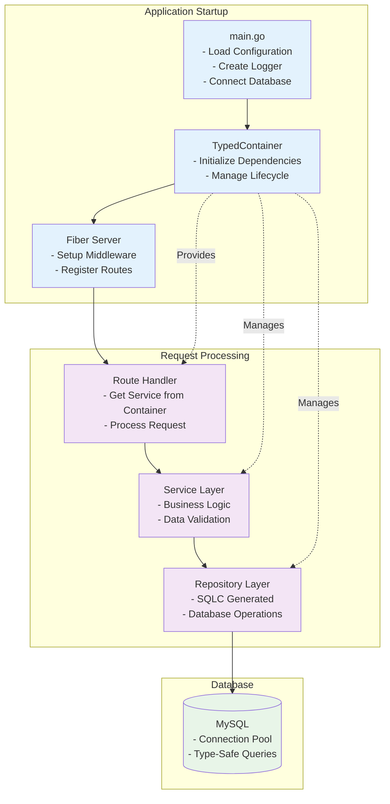

# Container-Based Dependency Injection Architecture

## Overview

This document explains the container pattern implementation in the Scaffold application, providing a clean, maintainable, and testable approach to dependency injection with **Fiber web framework** and **MySQL database**.

## The Problem with Manual Dependency Injection

### Current Approach Issues

```go
// main.go becomes cluttered as the application grows
userRepo := users.New(db)
productRepo := products.New(db)
orderRepo := orders.New(db)
paymentRepo := payments.New(db)

baseService := service.NewService(logger)
userService := service.NewUserService(baseService, userRepo)
productService := service.NewProductService(baseService, productRepo)
orderService := service.NewOrderService(baseService, orderRepo, userRepo, productRepo)
paymentService := service.NewPaymentService(baseService, paymentRepo, orderRepo)

// Every new service requires main.go changes
// Controllers need explicit injection for each dependency
// Testing becomes complex with multiple mocks
```

### Problems:
1. **main.go bloat**: Every new service requires changes to main.go
2. **Controller modifications**: Adding services requires changing controller constructors
3. **Tight coupling**: Controllers depend on specific service implementations
4. **Complex testing**: Mocking multiple dependencies is cumbersome
5. **Maintenance overhead**: Changes ripple through multiple files

## The Container Solution

### Core Concept

The container pattern centralizes all dependency management in a single location, providing clean access to any service or repository without tight coupling.

```go
// main.go stays clean regardless of number of services
database := db.MustConnect(conf, logger)
appContainer := container.NewTypedContainer(conf, logger, database)

server.RunWithCustomSetup(conf, logger, func(s *server.FiberServer) {
    s.SetupBusinessRoutesWithContainer(appContainer)
})
```

### Key Components

1. **TypedContainer**: Manages all dependencies with type safety
2. **Route Registration**: Uses container to access any service
3. **Handlers**: Get dependencies through container
4. **Testing**: Easy mocking via container

## Current Implementation

### 1. Container Structure

```go
// pkg/container/typed_container.go
type TypedContainer struct {
    // Infrastructure
    config   *viper.Viper
    logger   log.Logger
    database *sql.DB

    // Repositories - Type-safe versions with SQLC
    userRepository users.Querier
    // Add more repositories as interfaces are defined
    // productRepository products.Querier
    // orderRepository   orders.Querier

    // Services - Type-safe versions
    userService service.UserService
    // Add more services as interfaces are defined
    // productService service.ProductService
    // orderService   service.OrderService
}
```

### 2. Dependency Initialization

```go
func (c *TypedContainer) initializeDependencies() {
    // Initialize repositories with SQLC generated code
    c.userRepository = users.New(c.database)

    // Initialize base service
    baseService := service.NewService(c.logger)

    // Initialize services with their dependencies
    c.userService = service.NewUserService(baseService, c.userRepository)

    // Future repositories and services can be added here
    // c.productRepository = products.New(c.database)
    // c.productService = service.NewProductService(baseService, c.productRepository)
}
```

### 3. Type-Safe Getters

```go
// Infrastructure getters
func (c *TypedContainer) GetConfig() *viper.Viper {
    return c.config
}

func (c *TypedContainer) GetLogger() log.Logger {
    return c.logger
}

func (c *TypedContainer) GetDatabase() *sql.DB {
    return c.database
}

// Repository getters
func (c *TypedContainer) GetUserRepository() users.Querier {
    return c.userRepository
}

// Service getters
func (c *TypedContainer) GetUserService() service.UserService {
    return c.userService
}
```

### 4. Route Registration with Container

```go
// internal/routes/routes_container.go
func RegisterRoutesWithContainer(crc *ContainerRouteConfig) {
    // Create base handler with logger from container
    baseHandler := handler.NewHandler(crc.Container.GetLogger())

    // Register API routes group
    api := crc.App.Group("/api")
    v1 := api.Group("/v1")

    // Register domain-specific routes
    RegisterUserRoutesWithContainer(v1, baseHandler, crc.Container)
    // Future route registrations - no modification needed to existing routes
    // RegisterProductRoutesWithContainer(v1, baseHandler, crc.Container)
    // RegisterOrderRoutesWithContainer(v1, baseHandler, crc.Container)
}
```

### 5. Domain-Specific Route Registration

```go
// internal/routes/user_routes.go (container version)
func RegisterUserRoutesWithContainer(router fiber.Router, baseHandler *handler.Handler, container *container.TypedContainer) {
    // Get the user service from container
    userService := container.GetUserService()

    // Create user handler
    userHandler := handler.NewUserHandler(baseHandler, userService)

    // User routes group
    users := router.Group("/users")

    // Admin-specific user routes
    users.Get("/admin", userHandler.GetAdminUsers) // GET /api/v1/users/admin
    users.Get("/pending-verification", userHandler.GetPendingVerificationUsers) // GET /api/v1/users/pending-verification

    // Future user routes can be added here without affecting other modules
    // users.Get("/:id", userHandler.GetUserById)
    // users.Post("/", userHandler.CreateUser)
    // users.Put("/:id", userHandler.UpdateUser)
    // users.Delete("/:id", userHandler.DeleteUser)
}
```

## Adding New Domains (Zero Main.go Changes)

### Step 1: Create Repository and Service

```go
// 1. Create repository interface and implementation
// internal/repository/products/models.go
// internal/repository/products/querier.go
// internal/repository/products/product.sql.go (SQLC generated)

// 2. Create service interface and implementation
// internal/service/product.go
type ProductService interface {
    GetAllProducts(ctx context.Context) ([]products.Product, error)
    GetProductById(ctx context.Context, id int64) (products.Product, error)
    CreateProduct(ctx context.Context, product products.Product) error
}
```

### Step 2: Add to Container

```go
// In pkg/container/typed_container.go
type TypedContainer struct {
    // ... existing fields ...
    productRepository products.Querier      // Add this
    productService    service.ProductService // Add this
}

func (c *TypedContainer) initializeDependencies() {
    // ... existing initialization ...
    c.productRepository = products.New(c.database)  // Add this
    c.productService = service.NewProductService(baseService, c.productRepository)  // Add this
}

func (c *TypedContainer) GetProductRepository() products.Querier {  // Add this
    return c.productRepository
}

func (c *TypedContainer) GetProductService() service.ProductService {  // Add this
    return c.productService
}
```

### Step 3: Create Route Registration

```go
// In internal/routes/product_routes.go
func RegisterProductRoutesWithContainer(router fiber.Router, baseHandler *handler.Handler, container *container.TypedContainer) {
    productService := container.GetProductService()
    productHandler := handler.NewProductHandler(baseHandler, productService)
    
    products := router.Group("/products")
    products.Get("/", productHandler.GetAllProducts)
    products.Get("/:id", productHandler.GetProductById)
    products.Post("/", productHandler.CreateProduct)
    products.Put("/:id", productHandler.UpdateProduct)
    products.Delete("/:id", productHandler.DeleteProduct)
}
```

### Step 4: Register Routes

```go
// In internal/routes/routes_container.go
func RegisterRoutesWithContainer(crc *ContainerRouteConfig) {
    // ... existing code ...
    RegisterUserRoutesWithContainer(v1, baseHandler, crc.Container)
    RegisterProductRoutesWithContainer(v1, baseHandler, crc.Container)  // Add this line
}
```

**That's it!** No changes to main.go, server setup, or existing controllers.

## Database Integration

### SQLC Integration

The container works seamlessly with SQLC-generated code:

```go
// db/queries/user.sql
-- name: GetAdminUsers :many
SELECT * FROM users WHERE role = 'admin';

-- name: GetPendingVerificationUsers :many
SELECT * FROM users WHERE status = 'pending_verification';
```

```go
// Generated by SQLC: internal/repository/users/querier.go
type Querier interface {
    GetAdminUsers(ctx context.Context) ([]User, error)
    GetPendingVerificationUsers(ctx context.Context) ([]User, error)
}
```

### Database Connection Management

```go
// pkg/db/connection.go
func MustConnect(conf *viper.Viper, logger log.Logger) *sql.DB {
    db, err := NewConnection(conf, logger)
    if err != nil {
        logger.Fatal("Critical: Unable to establish database connection", log.Error(err))
        panic(err)
    }
    return db
}
```

## Benefits

### 1. Scalability
- Add unlimited services/repositories without modifying existing code
- Each domain is independent and self-contained
- No cascading changes when adding new features
- SQLC generates type-safe database code automatically

### 2. Maintainability
- Single source of truth for all dependencies
- Clear separation of concerns
- Easy to refactor or replace components
- Type-safe dependency access

### 3. Testability
```go
func TestUserHandler(t *testing.T) {
    // Create mock container
    mockContainer := &container.TypedContainer{}
    
    // Inject mocks
    mockContainer.RegisterService("order", mockOrderService)
    mockContainer.RegisterService("user", mockUserService)
    
    // Test with container
    app := fiber.New()
    RegisterOrderRoutesWithContainer(app, baseHandler, mockContainer)
    
    // Run tests...
}
```

### 4. Configuration Management
```go
// Environment-specific configurations
// configs/local.yml - Local development
// configs/docker.yml - Docker environment  
// configs/prod.yml - Production

// Container provides unified access
config := container.GetConfig()
dbHost := config.GetString("db.mysql.host")
logLevel := config.GetString("log.level")
```

## Architecture Flow



## Testing Strategy

### Unit Testing
```go
func TestUserService(t *testing.T) {
    // Mock repository
    mockRepo := &mockUserRepository{}
    
    // Create service with mock
    logger := createTestLogger()
    baseService := service.NewService(logger)
    userService := service.NewUserService(baseService, mockRepo)
    
    // Test service methods
    users, err := userService.GetAdminUsers(context.Background())
    // ... assertions
}
```

### Integration Testing
```go
func TestUserRoutes(t *testing.T) {
    // Create test container with real database
    container := createTestContainer()
    
    // Setup test app
    app := fiber.New()
    baseHandler := handler.NewHandler(container.GetLogger())
    RegisterUserRoutesWithContainer(app, baseHandler, container)
    
    // Test endpoints
    req := httptest.NewRequest("GET", "/api/v1/users/admin", nil)
    resp, err := app.Test(req)
    // ... assertions
}
```

## Future Enhancements

1. **Service Discovery**: Automatic service registration
2. **Lifecycle Management**: Graceful shutdown handling
3. **Health Checks**: Container-aware health monitoring
4. **Metrics**: Dependency usage tracking
5. **Configuration Validation**: Type-safe configuration binding

The container pattern provides a solid foundation for scaling the Scaffold application while maintaining clean architecture and testability. 